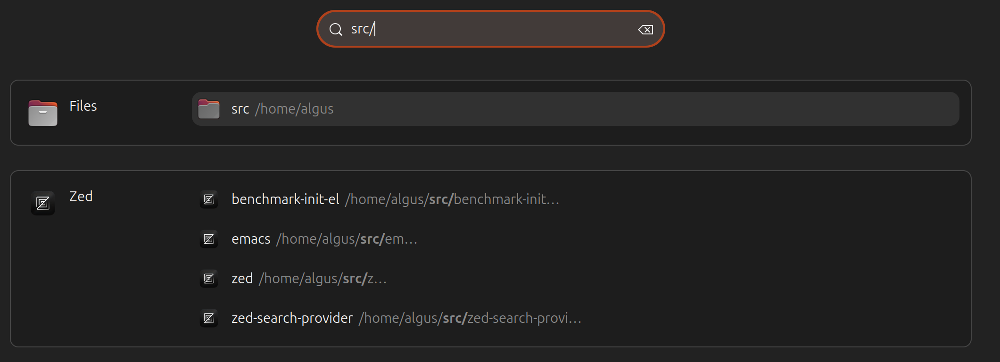

# Zed Search Provider

  

## Description

The Zed Search Provider Extension is a GNOME Shell extension that launches Zed for specific workspace via Gnome Shell search.

## Features

- Compatible with GNOME Shell versions 48, and potentially later releases.
- Compiles a list of Zed workspaces

## Installation

### Install requirements

- Debian/Ubuntu: `sudo apt-get install gir1.2-gda-5.0`

### Installing via Gnome Extensions

### Installing from the GitHub Repository

For the latest development version, you may need to ensure `git` and `node` are installed first. Proceed to the directory where you wish to download the source code and execute the following commands:

#### For GNOME 45+

    git clone https://github.com/hron/zed-search-provider.git
    cd zed-search-provider
    npm install && npm run setup

### Activating the Extension

Following installation, the extension must be enabled.

- Restart GNOME Shell (`Alt` + `F2`, `r`, `Enter`, or Log-Out/Log-In if operating on Wayland)
- The _Zed Search Provider_ extension should now appear in the _Extensions_ application. If not visible, reopen the application to refresh the data, and you can then enable it.

## Contribution

If you are interested in contributing, kindly fork the repository and create a feature branch. Pull requests are highly appreciated.
